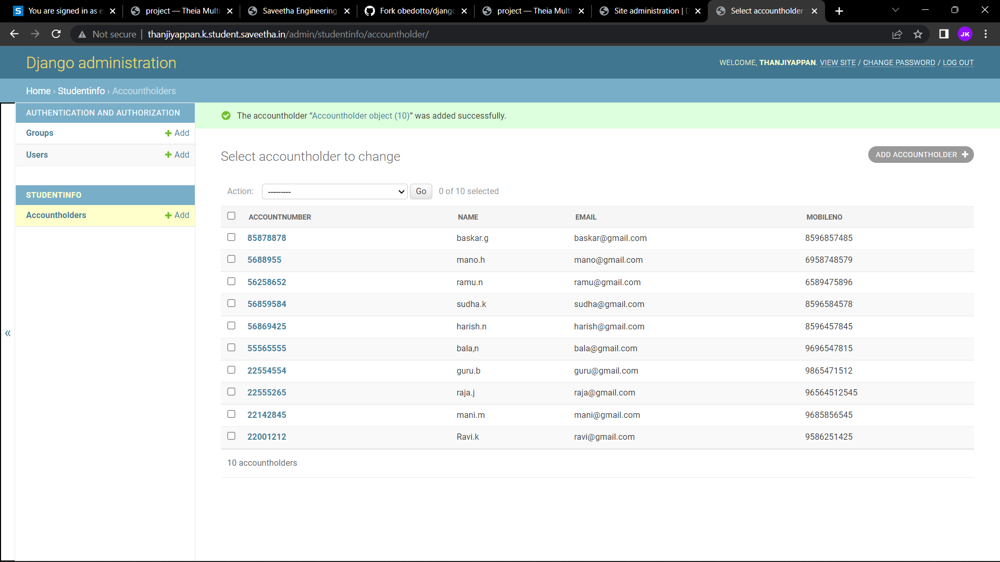

# Django ORM Web Application

## AIM
To develop a Django application to store and retrieve data from a database using Object Relational Mapping(ORM).

## Entity Relationship Diagram


## DESIGN STEPS

### STEP 1:
enter the python code for creating bankholder details

### STEP 2:
create bankholder details in django-orm

### STEP 3:
push the code to github


## PROGRAM
```
from django.db import models
from django.contrib import admin
# Create your models here.
class Accountholder(models.Model):
    accountnumber=models.CharField(max_length=8,help_text="enter your reference number")
    name=models.CharField(max_length=100)
    age=models.IntegerField()
    email=models.EmailField()
    mobileno=models.IntegerField(max_length=10)

class AccountholderAdmin(admin.ModelAdmin):
    list_display=('accountnumber','name','email','mobileno')
```

## OUTPUT



## RESULT
thus the experiment is executed sucessfully
